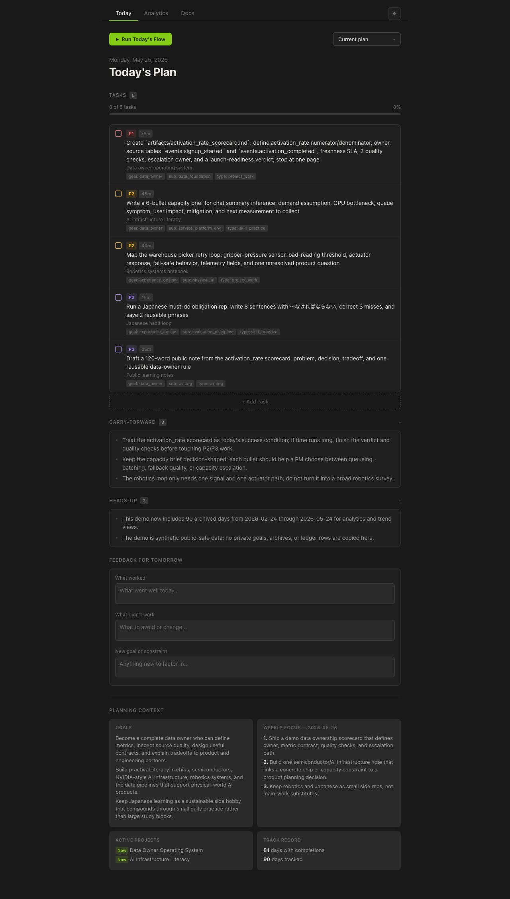
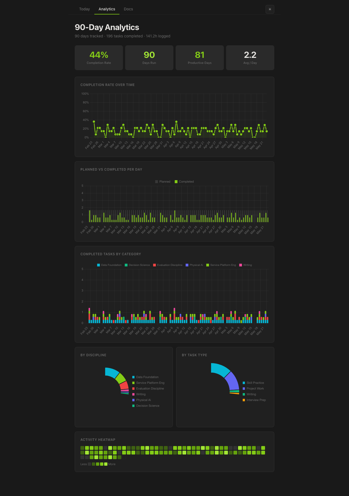
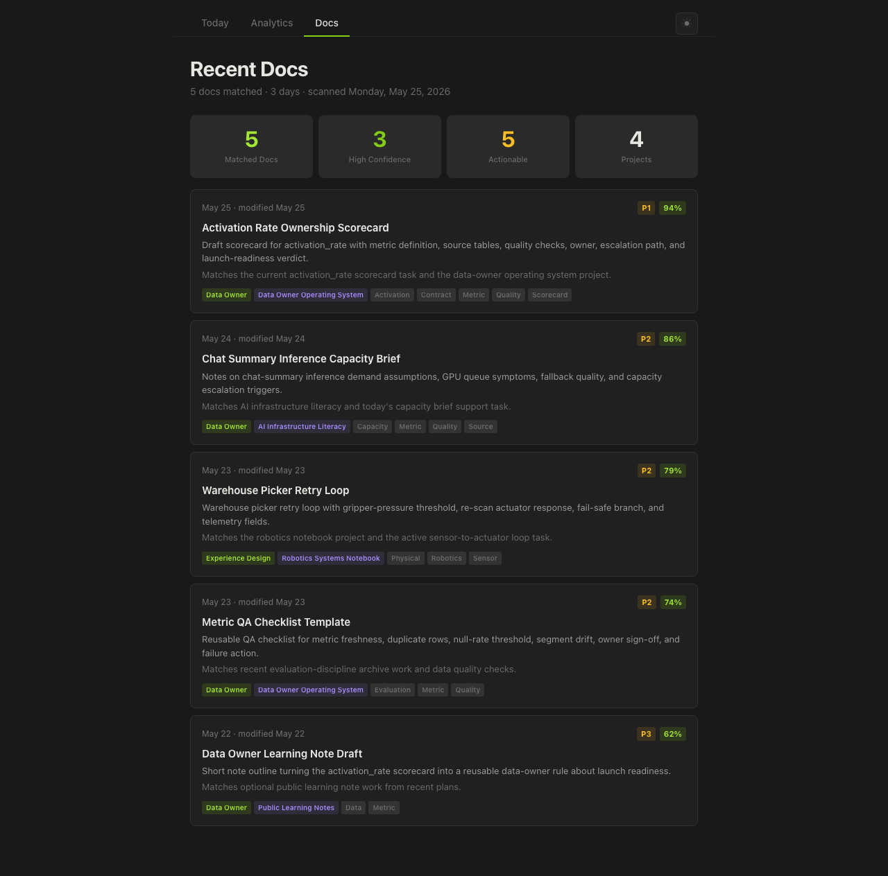

# Personal PM

Personal PM is a local CLI-friendly personal growth coach built around a reusable [`SKILL.md`](public/skill/personal-pm/SKILL.md). Run it with Codex, Claude Code, Gemini CLI, or another agent to convert goals, projects, and backlog into a realistic daily task plan.

It keeps unfinished work visible and uses completion history to make tomorrow's plan more realistic.

It is built for one practical loop:

```text
goals -> daily plan -> completion feedback -> better next plan
```

The system is local-first. Your real goals, tasks, archives, and logs live under `private/`. Reusable skill code, validators, templates, and demo data live outside `private/` so they can be shared safely.

## Product Promise

Personal PM helps you answer four daily questions:

1. What matters most today?
2. What is the smallest useful version of that work?
3. What can be skipped without breaking the day?
4. What pattern should tomorrow's plan learn from?

Good plans are not longer plans. A good plan has one clear `P1`, a few support tasks, optional lower-priority work, and a visible trail when something keeps slipping.

## Screenshots

These screenshots use the synthetic `demo/` dataset. They do not include private goals, archives, or task history.

### Daily Plan



### 90-Day Analytics



### Recent Docs Cache



## How It Works

1. **Set target goals**
   Write long-term goals, near-term deadlines, skill lanes, and daily practice expectations in `goals/goal.md`.

2. **Track active projects**
   Keep project status and next actions in `goals/projects.md`.

3. **Run the PM skill**
   Ask the `personal-pm` skill to run normal planning or focus on one discipline.

4. **Get today's plan**
   The skill writes or verifies `tasks/today.md` with one `P1`, one or two `P2` tasks, and optional `P3` tasks.

5. **Use the plan**
   Complete tasks, leave feedback, and let unfinished work carry forward with visible `backlog:Nd` metadata.

6. **Review projects and trends**
   Use the app's editable project view to keep next actions visible, then use analytics to see completion rate, discipline mix, and repeated misses.

7. **Let the planner learn**
   The runner regenerates `context/planning-insights.md` and `context/weekly-outcomes.md` from the archive. If a prior day had no completed active tasks, the next plan is reduced by task count or total planned minutes.

## Quick Start

Run commands from the repo root.

Try the public-safe demo:

```bash
python3 -m pip install -r requirements.txt
PERSONAL_PM_DATA_DIR=demo python3 scripts/validate_workspace.py --read-only
PERSONAL_PM_DATA_DIR=demo PYTHONPATH=app \
  python3 -m flask --app server run --host 127.0.0.1 --port 5151
```

Use the default private workspace:

```bash
python3 -m pip install -r requirements.txt
./setup.sh
```

Then fill `private/goals/goal.md` and `private/goals/projects.md` with your target goals, active projects, deadlines, disciplines, and next actions.

Validate and start the app:

```bash
python3 scripts/validate_workspace.py --read-only
PYTHONPATH=app \
  python3 -m flask --app server run --host 127.0.0.1 --port 5151
```

Then open the local app URL printed by Flask.

If port `5151` is busy, choose another local port.

## First-Run Weekly Setup

When you open the app and there is no weekly focus for the current week (or no overall goals yet), the Today tab shows a short guided setup. Pick a runner (Codex, Claude Code, or Gemini CLI — the same runners as "Run Today's Flow"), answer 3-5 questions tailored to your goals and projects, and it drafts a weekly focus you can edit on the Weekly tab.

- The selected agent CLI runs read-only and only returns JSON; it never edits files.
- Requires that runner's CLI on your `PATH`, or set `PERSONAL_PM_CODEX_BIN` / `PERSONAL_PM_CLAUDE_BIN` / `PERSONAL_PM_GEMINI_BIN`. Defaults to Codex.
- Set `PERSONAL_PM_ONBOARDING_MODEL` to pick a specific model for this step.
- You can skip it for the session, or choose "set it up manually" to use the Weekly tab form.
- Fresh workspaces created from `templates/` have no current-week focus, so this runs on first launch.

See [USAGE.md](USAGE.md#guided-weekly-setup) for the request flow and endpoints.

## Use The Skill

The skill contract lives at:

```text
public/skill/personal-pm/SKILL.md
```

In Codex, from this repo, use prompts like:

```text
Run the PM flow.
Run normal planning for today.
Run the PM flow focused on Data foundation.
```

Expected skill behavior:

1. Read `AGENTS.md` and `public/skill/personal-pm/SKILL.md`.
2. Resolve planner files through `PERSONAL_PM_DATA_DIR`, defaulting to `private/`.
3. Check whether `goals/goal.md` has enough goal context.
4. Ask for normal planning versus specific focus unless your prompt already provides it.
5. Roll forward stale daily state if needed.
6. Refresh generated outcome memory from the archive when rollover happened.
7. Write or verify `tasks/today.md` using the adaptive task/time cap.
8. Validate the result and report what changed.

To expose this repo's skill to a local Codex skills folder:

```bash
mkdir -p ~/.codex/skills
ln -s "$(pwd)/public/skill/personal-pm" ~/.codex/skills/personal-pm
```

If the symlink already exists, inspect it before changing it.

## Daily Runner

The local runner wraps the skill with goal preflight, focus selection, and validation:

```bash
private/automation/scripts/personal_pm_runner.sh
```

Skip the focus prompt with an explicit focus:

```bash
PERSONAL_PM_FOCUS_OVERRIDE="Data foundation" \
  private/automation/scripts/personal_pm_runner.sh
```

Preview the prompt without changing files:

```bash
PERSONAL_PM_DRY_RUN=1 private/automation/scripts/personal_pm_runner.sh
```

Codex-backed runner calls log token usage under the active data root:

```text
data/agent_token_usage.jsonl
```

Each row records the `run_id`, flow step, model name when available, model-call sequence, input tokens, cached input tokens, output tokens, reasoning tokens, and total tokens. Set `PERSONAL_PM_TOKEN_USAGE_LOG` to write the JSONL file somewhere else.

## Morning Launcher

Use one command to prepare or review the day:

```bash
scripts/pm_morning.sh
```

The launcher checks whether `tasks/today.md` is current and whether the latest autonomous run failed. If the plan is stale, missing, or the latest same-day autonomous run failed, it runs `private/automation/scripts/autonomous_daily_runner.sh`; otherwise it opens the app without rerunning the planner.

It prefers `python3.11` when available. Set `PERSONAL_PM_PYTHON_BIN` to override the interpreter.

Autonomous run records in `data/agent_runs.jsonl` include the shared `run_id`, model summary, and token-usage summary when Codex reports usage.

Preview the launcher without running the planner, starting Flask, or opening a browser:

```bash
PERSONAL_PM_DRY_RUN=1 scripts/pm_morning.sh
```

## Optional GitHub Sync

`scripts/github_sync.py` can mirror local projects and durable daily tasks into private GitHub Issues and an optional private GitHub Project v2. The sync uses `gh` authentication, dry-runs by default, refuses public GitHub targets, and keeps sync IDs under the active private data root.

Start with:

```bash
python3 scripts/github_sync.py --data-dir demo --json
```

Before writing private data to GitHub, run `--preflight` against the private issue repo and optional Project v2 target.

Private target settings can live in `DATA_DIR/config/github_sync.json`; use `--init-config` or copy `templates/config/github_sync.example.json`.

See [USAGE.md](USAGE.md#github-issues-and-projects-sync) for setup and apply commands, and [docs/github-sync.md](docs/github-sync.md) for the implementation checklist.

## Repo Map

| Path | Role |
| --- | --- |
| `private/` | Local-only real goals, tasks, archives, logs, and automation. Ignored by git; do not publish. |
| `public/skill/personal-pm/` | Shareable skill instructions, references, validator, and ledger helper. |
| `demo/` | Synthetic public-safe data for screenshots, demos, and app testing. |
| `templates/` | Blank starter files for a new private data root. |
| `app/` | Local web interface that reads the active data root. |
| `scripts/` | Repo-level validators and cache builders. |
| `setup.sh` | Non-destructive bootstrap from `templates/` into `private/` or `PERSONAL_PM_DATA_DIR`. |
| `docs/screenshots/` | README screenshots generated from `demo/`. |
| `requirements.txt` | Python app dependencies for new users. |
| `pyproject.toml` | Project metadata plus Black and Ruff defaults. |
| `.github/workflows/validate.yml` | CI check that validates the public-safe demo workspace. |
| `LICENSE` | MIT License for public use and reuse. |

## Data Root Contract

Reusable code reads planner files from `PERSONAL_PM_DATA_DIR`.

When `PERSONAL_PM_DATA_DIR` is unset in this repo, app and script code use `private/`.

Expected data-root layout:

```text
goals/goal.md
goals/projects.md
context/weekly-focus.md
context/planner-memory.md
context/daily-outcomes.md
context/planning-insights.md
context/weekly-outcomes.md
tasks/today.md
tasks/backlog.md
tasks/archive/log.md
data/task_log.csv
data/agent_token_usage.jsonl
```

Optional docs cache:

```text
context/recent-drive-docs.json
```

Optional GitHub sync state:

```text
config/github_sync.json
data/github_sync_map.json
```

Generated outcome memory:

- `context/planning-insights.md`: latest completion rate, zero-completion streak, learned task-type patterns, and the next task/time cap.
- `context/weekly-outcomes.md`: weekly rollups that separate completed, incomplete, and deleted/canceled tasks.
- `config/github_sync.json`: optional private GitHub issue repo and Project v2 target settings for local sync.
- `data/github_sync_map.json`: local issue/project IDs for the optional GitHub sync. Keep it private and out of version control.

## Documentation Map

- [USAGE.md](USAGE.md): day-to-day operating guide.
- [docs/github-sync.md](docs/github-sync.md): optional private GitHub Issues/Projects sync checklist.
- [public/skill/personal-pm/SKILL.md](public/skill/personal-pm/SKILL.md): canonical skill behavior.
- [demo/README.md](demo/README.md): public-safe sample data notes.
- [templates/README.md](templates/README.md): starter workspace notes.

## Safety Rules

- Keep real personal goals, archives, logs, scheduler settings, and external-source cache data out of `public/`.
- Keep normal planning local-only. Google Drive, Docs, Sheets, email, and browser-derived context are opt-in.
- Test public process or interface changes against `demo/` before trusting them against `private/`.

## Useful Checks

```bash
PERSONAL_PM_DATA_DIR=demo python3 scripts/validate_workspace.py --read-only
python3 scripts/validate_workspace.py --read-only
python3 public/skill/personal-pm/scripts/validate_today.py --json
zsh -n private/automation/scripts/personal_pm_runner.sh
zsh -n private/automation/scripts/autonomous_daily_runner.sh
zsh -n scripts/pm_morning.sh
```
