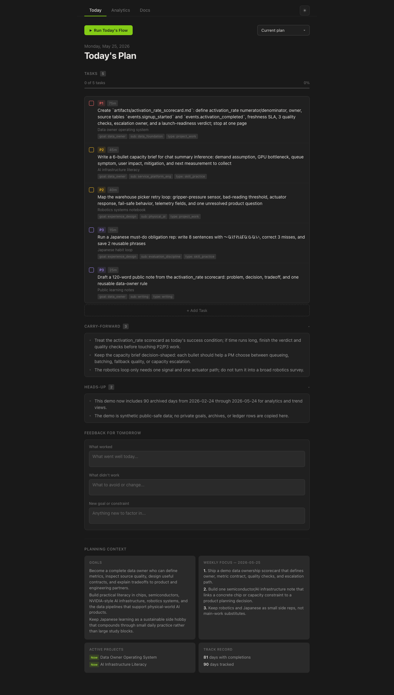

# Personal PM

Personal PM is a reusable [planning skill](public/skill/personal-pm/SKILL.md) for
turning goals, projects, and completion feedback into realistic work. Use it in
Codex, Claude Code, Gemini CLI, or another agent. The local UI opens by default during interactive planning to visualize the same
files. The skill and workflow remain primary; headless use is supported.

```text
current priorities -> one useful next action -> closeout -> next plan
```

The skill checks what still matters, acknowledges work already done, and proposes
one useful next action. After a long gap it refreshes priorities; with unknown
capacity it starts small. Goals, plans, and history stay local.

## Start with the skill

Use Python 3.10+ and your existing agent. The skill helpers need only Python's
standard library. Run these commands from the checkout:

```bash
./setup.sh
```

This creates missing starter files in `private/` without replacing existing files.
Set `PERSONAL_PM_DATA_DIR` to use another workspace.

To make the repo-backed skill discoverable in Codex:

```bash
mkdir -p ~/.codex/skills
ln -s "$(pwd)/public/skill/personal-pm" ~/.codex/skills/personal-pm
```

Inspect an existing destination before creating the symlink. Keep the checkout in
place. In another agent, load `public/skill/personal-pm/SKILL.md` from this repo.

Then ask:

```text
Set up Personal PM with me, choose this week's focus, and plan today.
```

The skill collects missing goal, project, and capacity context in conversation,
saves a weekly focus, then writes a validated daily plan. You can also fill the
starter Markdown files yourself. Goal and subcategory identifiers are configurable
in `config/planner.json`; see [the vocabulary guide](public/skill/personal-pm/references/metadata.md).

## Use the planning loop

| Request | Result |
| --- | --- |
| “Help me choose this week's focus.” | Grounded weekly priorities and constraints. |
| “Run normal planning for today.” | Current priorities and capacity turned into a short plan. |
| “Plan today focused on my language project.” | Explicit focus applied to eligible work. |
| “I finished the first task; the second was too broad.” | Reported outcomes and useful feedback recorded. |
| “Review this week and plan next week.” | Evidence from outcomes informs next week's priorities. |

Start questions combine missing focus, priorities, and available time. Old tasks
need a relevance check before reuse. Repeated same-day runs verify the existing
plan when it still fits; rollover preserves history without duplicates. Unreported
outcomes stay unknown and do not trigger failure-based scope limits.

Read the plan directly in `private/tasks/today.md`. The agent can also use the
bundled headless helpers:

```bash
python3 public/skill/personal-pm/scripts/pm.py status
python3 public/skill/personal-pm/scripts/pm.py --help
python3 scripts/validate_workspace.py --read-only
```

These commands do not launch an agent or a browser. The helper writes validated
agent-authored drafts; planning judgment remains in the conversation. See
[USAGE.md](USAGE.md) for completion, feedback, weekly-save, and rollover commands.

## Visual companion

Today pairs your plan with feedback for tomorrow. Projects uses expandable rows;
Weekly puts the latest focus and outcome progress first.

Interactive skill runs open or reuse the UI for review, checkboxes, feedback, and
project edits. Ask for “headless” to skip it. Install the companion dependencies:

```bash
python3 -m pip install -r requirements-ui.txt
./scripts/pm_morning.sh --ui-only
```

The launcher opens your browser and reuses the matching workspace server, choosing
an available port if needed. It does not run the planner. Set
`PERSONAL_PM_PYTHON_BIN` if Flask is installed under a different Python interpreter;
use `PERSONAL_PM_DATA_DIR=demo` for synthetic examples.

The UI reads and writes the same Markdown/CSV artifacts through helpers bundled
with the skill. Its guided weekly setup uses the same weekly coaching contract;
its daily launcher supplies the user's selection to the skill. UI-triggered agent
calls use a local CLI or an explicitly selected API. **Setting → API connections** supports OpenAI,
xAI/Grok, OpenRouter, and Sakana AI, with system-keychain, temporary, or environment
credentials. API daily plans are reviewed before saving. The same API helpers work
headlessly. See [API setup](public/skill/personal-pm/references/api-connections.md)
and [guided setup](USAGE.md#guided-weekly-setup).

All screenshots below use synthetic demo data.



[Analytics screenshot](docs/screenshots/demo-analytics.png) ·
[Recent docs screenshot](docs/screenshots/demo-docs.png)

## Optional integrations

- [Local automation](USAGE.md#run-the-local-wrapper): morning wrappers require maintainer-only adapters; direct skill use works in a public clone.
- [Usage logging](USAGE.md#token-usage-logging): app/CLI run and token logs stay in the local data root.
- [GitHub sync](USAGE.md#github-issues-and-projects-sync): mirrors selected work to private Issues/Projects using `gh`; preview and preflight before applying.

## Code and data ownership

| Path | Role |
| --- | --- |
| `public/skill/personal-pm/` | Conversational workflows, references, and shared Python helpers. |
| `app/` | Optional UI, HTTP endpoints, and agent CLI adapters. |
| `private/` | Default local-only data root; ignored by git. |
| `templates/` | Blank starter workspace. |
| `demo/` | Synthetic examples for checks and screenshots. |
| `scripts/` | Workspace validation and optional integrations/launchers. |

The skill owns planning guidance. Shared helpers own storage and deterministic
validation. Interfaces present the same artifacts and invoke those workflows.
Run one writer at a time. Keep private data, external caches, credentials,
scheduler configuration, and logs out of version control.

## Validation

```bash
# Headless behavior, with third-party packages disabled:
python3 -S -m unittest discover -s tests -p 'test_skill_workflow.py' -v
python3 -S scripts/validate_workspace.py --data-dir demo --read-only

# Optional UI/API and integration regression suite (requires UI dependencies):
python3 -m unittest discover -s tests -v
```

The headless suite checks file behavior from fresh setup through rollover. It does
not establish the quality of live agent judgment. Use the scenarios and rubric in
[skill evaluation](docs/skill-evaluation.md) when changing planning guidance.
