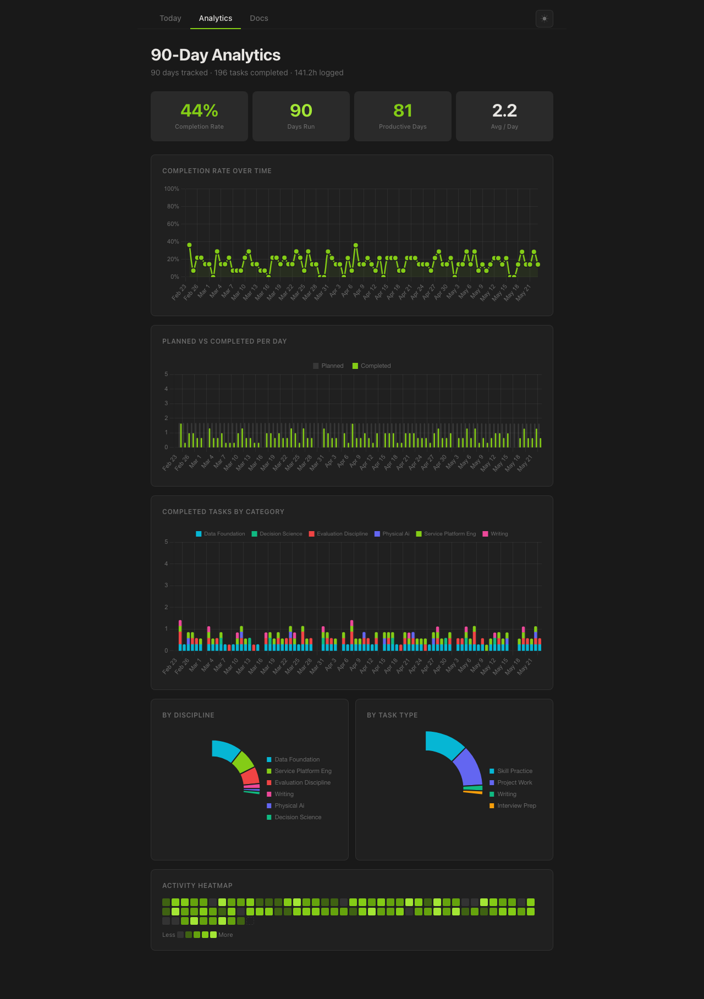
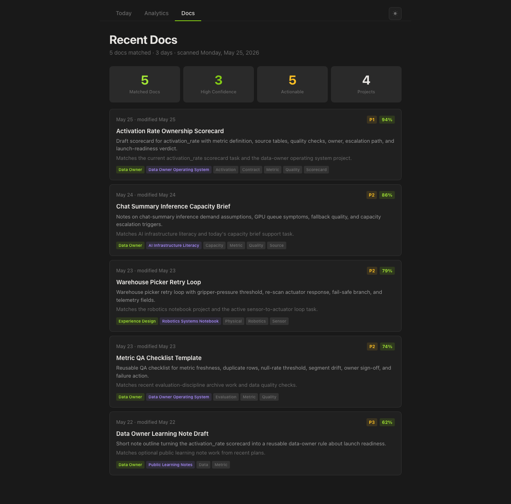

# Personal PM

Personal PM is a local, CLI-friendly personal growth coach built around a reusable [`SKILL.md`](public/skill/personal-pm/SKILL.md). Run it with Codex, Claude Code, Gemini CLI, or another agent to turn goals, projects, and backlog into a realistic daily plan.

```text
goals -> daily plan -> completion feedback -> better next plan
```

Real goals, tasks, archives, and logs stay under the local-only `private/` data root. Shareable code, validators, templates, and synthetic demo data live outside it.

## What It Does

Personal PM helps answer four questions each day:

1. What matters most?
2. What is the smallest useful version of that work?
3. What can be skipped without breaking the day?
4. What should tomorrow's plan learn from today?

The planner combines long-term goals, active projects, weekly focus, backlog, and completion history. It produces one clear `P1`, one or two support tasks, and optional `P3` work; carries unfinished tasks forward with visible `backlog:Nd` metadata; and reduces the next plan after a zero-completion day. The app also supports project editing and analytics for completion rate, discipline mix, and repeated misses.

## Screenshots

All screenshots use the synthetic `demo/` dataset, not private goals, archives, or task history.

### Daily Plan


### 90-Day Analytics



### Recent Docs Cache



## Quick Start

Run commands from the repo root.

Try the public-safe demo:

```bash
python3 -m pip install -r requirements.txt
PERSONAL_PM_DATA_DIR=demo python3 scripts/validate_workspace.py --read-only
PERSONAL_PM_DATA_DIR=demo PYTHONPATH=app \
  python3 -m flask --app server run --host 127.0.0.1 --port 5151
```

Create the default private workspace:

```bash
python3 -m pip install -r requirements.txt
./setup.sh
```

Fill `private/goals/goal.md` and `private/goals/projects.md` with goals, deadlines, disciplines, active projects, and next actions. Then validate and start the app:

```bash
python3 scripts/validate_workspace.py --read-only
PYTHONPATH=app \
  python3 -m flask --app server run --host 127.0.0.1 --port 5151
```

Open the local URL printed by Flask. If port `5151` is busy, choose another port.

## First-Run Weekly Setup

If the current week has no weekly focus—or the workspace has no overall goals—the Today tab opens a guided setup. Fresh workspaces created from `templates/` meet this condition on first launch.

1. Review, add, edit, or remove overall goals and save them through the local parser.
2. Answer at least four of 6–8 tailored questions about outcomes, capacity, blockers, trade-offs, and definition of done.
3. Review and edit the generated weekly focus.

The selected Codex, Claude Code, or Gemini CLI runner receives current goal, project, and week context plus your answers. It runs read-only and returns JSON that the app validates before saving through its normal writers; the runner never edits files or rewrites your goals directly. The setup can be skipped for the session or completed manually in the Weekly tab.

The runner must be on `PATH`; alternatively set `PERSONAL_PM_CODEX_BIN`, `PERSONAL_PM_CLAUDE_BIN`, or `PERSONAL_PM_GEMINI_BIN`. Codex is the default, and `PERSONAL_PM_ONBOARDING_MODEL` selects a specific model. See [USAGE.md](USAGE.md#guided-weekly-setup) for the request flow and endpoints.

## Run Planning

The canonical planner contract is [`public/skill/personal-pm/SKILL.md`](public/skill/personal-pm/SKILL.md). In Codex, try:

```text
Run the PM flow.
Run normal planning for today.
Run the PM flow focused on Data foundation.
```

The skill:

1. Resolves planner data through `PERSONAL_PM_DATA_DIR`, defaulting to `private/`.
2. Checks that the goal file contains enough context.
3. Asks for normal planning or a specific focus unless the prompt already supplies it.
4. Rolls stale daily state forward and refreshes generated outcome memory when needed.
5. Writes or verifies `tasks/today.md` within the adaptive task/time cap.
6. Validates the plan and reports what changed.

To expose the skill to a local Codex skills folder:

```bash
mkdir -p ~/.codex/skills
ln -s "$(pwd)/public/skill/personal-pm" ~/.codex/skills/personal-pm
```

Inspect an existing symlink before replacing it.

## Local Automation

The daily runner adds goal preflight, focus selection, and validation:

```bash
private/automation/scripts/personal_pm_runner.sh
```

Supply a focus or preview its prompt without changing files:

```bash
PERSONAL_PM_FOCUS_OVERRIDE="Data foundation" \
  private/automation/scripts/personal_pm_runner.sh

PERSONAL_PM_DRY_RUN=1 private/automation/scripts/personal_pm_runner.sh
```

Codex-backed runs log the shared run ID, flow step, model, call sequence, and input, cached, output, reasoning, and total token counts to `data/agent_token_usage.jsonl` under the active data root. Set `PERSONAL_PM_TOKEN_USAGE_LOG` to use another path.

For a one-command morning check, run:

```bash
scripts/pm_morning.sh
```

The launcher runs `private/automation/scripts/autonomous_daily_runner.sh` when today's plan is stale, missing, or follows a failed same-day autonomous run; otherwise it opens the app without replanning. It prefers `python3.11`, supports `PERSONAL_PM_PYTHON_BIN`, and records the shared run ID, model summary, and available token summary in `data/agent_runs.jsonl`.

Preview without planning, starting Flask, or opening a browser:

```bash
PERSONAL_PM_DRY_RUN=1 scripts/pm_morning.sh
```

## Optional GitHub Sync

`scripts/github_sync.py` mirrors local projects and durable daily tasks into private GitHub Issues and an optional private GitHub Project v2. It uses `gh` authentication, dry-runs by default, refuses public targets, and stores sync IDs under the private data root.

```bash
python3 scripts/github_sync.py --data-dir demo --json
```

Before applying changes, run `--preflight` against the private issue repository and optional Project v2 target. Settings live in `DATA_DIR/config/github_sync.json`; initialize them with `--init-config` or copy `templates/config/github_sync.example.json`.

See [USAGE.md](USAGE.md#github-issues-and-projects-sync) for commands and [docs/github-sync.md](docs/github-sync.md) for the implementation checklist.

## Repository and Data Layout

| Path | Role |
| --- | --- |
| `private/` | Default local-only data root; ignored by git. |
| `public/skill/personal-pm/` | Shareable planner contract, references, validator, and ledger helper. |
| `demo/` | Synthetic data for screenshots, demos, and tests. |
| `templates/` | Blank starter data for a new private workspace. |
| `app/` | Local web interface for the active data root. |
| `scripts/` | Repo-level runners, validators, sync, and cache helpers. |
| `setup.sh` | Non-destructive bootstrap into `private/` or `PERSONAL_PM_DATA_DIR`. |
| `docs/` | Screenshots and implementation guides. |

Reusable code reads planner files from `PERSONAL_PM_DATA_DIR`; when unset, this repository uses `private/`.

```text
goals/goal.md
goals/projects.md
context/weekly-focus.md
context/planner-memory.md
context/daily-outcomes.md
context/planning-insights.md
context/weekly-outcomes.md
tasks/today.md
tasks/backlog.md
tasks/archive/log.md
data/task_log.csv
data/agent_token_usage.jsonl
```

Optional local state includes:

```text
context/recent-drive-docs.json
config/github_sync.json
data/github_sync_map.json
```

`context/planning-insights.md` tracks completion patterns and the next task/time cap. `context/weekly-outcomes.md` rolls up completed, incomplete, and deleted/canceled work. GitHub configuration and sync IDs remain private and out of version control.

## Documentation

- [USAGE.md](USAGE.md): day-to-day operation and API details.
- [public/skill/personal-pm/SKILL.md](public/skill/personal-pm/SKILL.md): canonical planner behavior.
- [docs/github-sync.md](docs/github-sync.md): private GitHub sync checklist.
- [demo/README.md](demo/README.md): public-safe sample data.
- [templates/README.md](templates/README.md): starter workspace notes.

## Safety

- Keep real goals, tasks, archives, logs, scheduler settings, app settings, and external-source caches out of version control.
- Keep normal planning local-only. Google Drive, Docs, Sheets, email, browser context, and GitHub sync are opt-in.
- Test public workflow and interface changes against `demo/` before using them with private data.
- Treat model-generated weekly setup output as untrusted data: validate it before writing and never execute it.

## Useful Checks

```bash
PERSONAL_PM_DATA_DIR=demo python3 scripts/validate_workspace.py --read-only
python3 scripts/validate_workspace.py --read-only
python3 public/skill/personal-pm/scripts/validate_today.py --json
zsh -n private/automation/scripts/personal_pm_runner.sh
zsh -n private/automation/scripts/autonomous_daily_runner.sh
zsh -n scripts/pm_morning.sh
```
